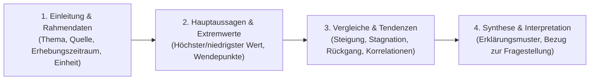

# 🎓 telc C1 Hochschule & Wissenschaftssprache · Studium & Akademischer Diskurs

> **Offizielles Hochschulprofil:**  
> Basierend auf den telc Lehrmaterialien der Reihe *Einfach zum Studium! C1* (Kopiervorlagen Module 1–10) und den KMK/HRK-Richtlinien für den Hochschulzugang internationaler Studienbewerber.  
> **Anerkennung:** Das Zertifikat **telc Deutsch C1 Hochschule** befreit bundesweit an allen Universitäten und Hochschulen vom Nachweis der sprachlichen Studierfähigkeit (gleichwertig zu TestDaF 4x4 und DSH-2).

---

## 🧭 Inhaltsverzeichnis
1. [Akademische Konnektoren & Satzverknüpfung](#1-akademische-konnektoren)
2. [Wissenschaftlicher Nominalstil vs. Verbalstil](#2-nominalstil-vs-verbalstil)
3. [Grafik- und Diagrammbeschreibung (Methodik & Redemittel)](#3-grafik--und-diagrammbeschreibung)
4. [Textstrukturierung & Quellenverweise (Zitierkonventionen)](#4-textstrukturierung--zitierkonventionen)
5. [Mündliche Diskussionsführung im Seminar](#5-diskussionsfuehrung-im-seminar)

---

## 1. Akademische Konnektoren
In universitären Hausarbeiten und Klausuren ersetzen hochsprachliche Konnektoren einfache alltagssprachliche Bindeglieder:

| Funktion | Alltagssprache (B1/B2) | Wissenschaftssprache (C1 Hochschule) | Beispielsatz |
| :--- | :--- | :--- | :--- |
| **Kausal** *(Begründung)* | weil, da | **in Anbetracht (+ Gen.)**, **aufgrund**, **infolge**, **angesichts** | *In Anbetracht der veränderten demografischen Rahmenbedingungen müssen Rentensysteme reformiert werden.* |
| **Konzessiv** *(Gegengrund)* | obwohl, trotzdem | **ungeachtet (+ Gen.)**, **wenngleich**, **nichtsdestoweniger**, **obschon** | *Ungeachtet der hohen Anschaffungskosten amortisiert sich die Photovoltaikanlage binnen weniger Jahre.* |
| **Konsekutiv** *(Folge)* | deshalb, so dass | **infolgedessen**, **demzufolge**, **somit**, **daraus resultierend** | *Die Messwerte wichen signifikant ab; infolgedessen musste das Experiment wiederholt werden.* |
| **Adversativ** *(Gegensatz)* | aber, sondern | **im Gegensatz zu**, **hingegen**, **wohingegen**, **demgegenüber** | *Während fossile Energieträger begrenzt sind, stehen regenerative Quellen unbegrenzt zur Verfügung.* |
| **Modal** *(Art & Weise)* | dadurch dass, mit | **mittels (+ Gen.)**, **anhand (+ Gen.)**, **unter Zuhilfenahme (+ Gen.)** | *Anhand empirischer Daten lässt sich diese Hypothese statistisch untermauern.* |

---

## 2. Wissenschaftlicher Nominalstil
Der Nominalstil verdichtet komplexe Sachverhalte durch Nomen, Genitivattribute und Partizipialkonstruktionen:

### Transformationsmatrix (Verbalstil $\to$ Nominalstil):
1. **Verbal:** *Als die Bundesregierung die Gesetze novellierte, protestierten viele Verbände.*  
   $\to$ **Nominal:** *Bei der Novellierung der Gesetze durch die Bundesregierung kam es zu zahlreichen Protesten seitens der Verbände.*
2. **Verbal:** *Weil der Meeresspiegel kontinuierlich ansteigt, sind viele Küstenstädte bedroht.*  
   $\to$ **Nominal:** *Aufgrund des kontinuierlichen Meeresspiegelanstiegs drohen gravierende Gefahren für zahlreiche Küstenmetropolen.*
3. **Verbal:** *Nachdem die Forscher die Proben sorgfältig analysiert hatten, veröffentlichten sie die Studie.*  
   $\to$ **Nominal:** *Nach sorgfältiger Analyse der Proben erfolgte die Publikation der wissenschaftlichen Studie.*

---

## 3. Grafik- und Diagrammbeschreibung
In Prüfungsteil *Schriftlicher Ausdruck (Aufgabe 1)* von telc C1 Hochschule müssen Sie komplexe Schaubilder präzise versprachlichen:

### Unverzichtbare Redemittel:
- **Einleitung:**  
  *„Das vorliegende Säulendiagramm / Liniendiagramm veranschaulicht die Entwicklung des weltweiten Energiebedarfs im Zeitraum von 2000 bis 2025. Die Angaben basieren auf Daten des Statistischen Bundesamtes und sind in Prozent / absoluten Zahlen ausgewiesen.“*
- **Entwicklung & Tendenzen:**  
  *„Ein kontinuierlicher Anstieg ist bei den erneuerbaren Energien zu verzeichnen, deren Anteil sich im Beobachtungszeitraum nahezu verdreifacht hat.“*  
  *„Demgegenüber ist der Verbrauch fossiler Brennstoffe um knapp 15 Prozentpunkte eingebrochen / rückläufig.“*  
  *„Im Jahr 2018 erreichte die Kurve mit 45 Millionen Tonnen ihren vorläufigen Höchststand / Zenit, woraufhin eine Phase der Stagnation einsetzte.“*
- **Vergleiche:**  
  *„Im Vergleich zum Ausgangsjahr stieg der Wert um das Doppelte / verdreifachte sich.“*  
  *„Mit einem Anteil von 42% rangiert Deutschland an der Spitze, gefolgt von Frankreich mit 28%, während Polen das Schlusslicht bildet.“*

---

## 4. Textstrukturierung & Zitierkonventionen
- **Gedankengang einleiten:**  
  *„Im Zentrum der wissenschaftlichen Debatte steht die Frage, inwieweit...“*  
  *„Zur Klärung dieser Kontroverse sollen im Folgenden drei wesentliche Dimensionen beleuchtet werden.“*
- **Argumente gewichten:**  
  *„Ein weiteres, nicht zu vernachlässigendes Argument liegt in...“*  
  *„Viel schwerer wiegt jedoch der Umstand, dass...“*  
  *„Dies darf jedoch nicht darüber hinwegtäuschen, dass...“*
- **Autoren & Quellen referenzieren:**  
  *„Gemäß Müller (2024) lässt sich ein direkter Kausalzusammenhang feststellen.“*  
  *„Im Einklang mit neueren soziologischen Erkenntnissen argumentiert Schmidt, dass...“*  
  *„Kritiker halten dieser These entgegen, dass empirische Belege bislang lückenhaft seien.“*

---

## 5. Diskussionsführung im Seminar
Im akademischen Seminar kommt es auf differenzierte, sachliche Argumentation und höflichen Widerspruch an:

- **Eigene Position vorsichtig formulieren (Hedging):**  
  *„Es drängt sich der Eindruck auf, dass die bisherigen Erklärungsansätze zu kurz greifen.“*  
  *„Man könnte geneigt sein anzunehmen, dass... Dennoch zeigen die Daten ein anderes Bild.“*
- **Widerspruch artikulieren:**  
  *„Diesem Argument möchte ich mit aller Entschiedenheit entgegentreten, da es die Ursachen verkennt.“*  
  *„Ich teile Ihre Einschätzung zwar in Bezug auf Punkt A, halte die Schlussfolgerung hinsichtlich Punkt B jedoch für verfrüht.“*
- **Zum Diskurs beitragen:**  
  *„Darf ich an dieser Stelle ein konkretes Gegenbeispiel aus der Forschungspraxis anführen?“*  
  *„Vor diesem Hintergrund stellt sich die Anschlussfrage, welche praktischen Konsequenzen sich daraus ableiten lassen.“*
