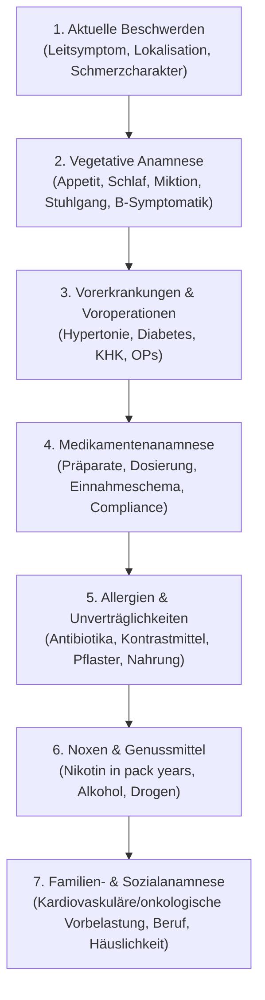

# 🩺 telc Deutsch Pflege & Medizin · Fachwortschatz & Klinische Praxis

> **Quellenbasis:**  
> Basierend auf den offiziellen telc Unterrichtsmaterialien der Reihe *Trainingseinheiten Deutsch Pflege* (Arbeitsblätter 1–9) und *Trainingseinheiten Deutsch Medizin* (Fallbeispiele, Anamnese, Arzt-Patienten-Kommunikation) aus dem offiziellen [telc Downloadbereich](https://www.telc.net/lehrmaterialien/downloadbereich/).  
> Geeignet für die Vorbereitung auf: **telc Deutsch B1·B2 Pflege** und **telc Deutsch B2·C1 Medizin (Approbation / Fachsprachprüfung der Landesärztekammern)**.

---

## 🧭 Inhaltsverzeichnis
1. [Anatomie & Organsysteme: Fachbegriff vs. Laiensprache](#1-anatomie--organsysteme)
2. [Der standardisierte Anamnesebogen & Aufnahmegespräch](#2-anamnesebogen--aufnahmegespraech)
3. [Strukturiertes Übergabegespräch nach dem ISBAR-Schema](#3-strukturiertes-uebergabegespraech-isbar)
4. [Klinische Fachabkürzungen & Dokumentationskürzel](#4-klinische-fachabkuerzungen)
5. [Arztbrief-Formulierungen & Epikrise](#5-arztbrief-formulierungen)
6. [Notfallsituationen & Deeskalation in der Klinik](#6-notfallsituationen--deeskalation)

---

## 1. Anatomie & Organsysteme
In der Prüfung müssen Sie mühelos zwischen der **interprofessionellen Fachsprache** (mit Ärzten/Pflegekollegen) und der **verständlichen Laiensprache** (mit Patienten und Angehörigen) wechseln können:

| Fachbegriff (Medizin) | Laiensprache (Patientenaufklärung) | English Equivalent | Typischer Beispielsatz |
| :--- | :--- | :--- | :--- |
| **das Abdomen** | der Bauch / Bauchraum | abdomen / belly | Wir tasten jetzt vorsichtig Ihr **Abdomen** ab. |
| **die Cephalgie** | die Kopfschmerzen | headache | Leiden Sie häufiger unter diesen **Kopfschmerzen**? |
| **die Dyspnoe** | die Atemnot / Kurzatmigkeit | dyspnea / shortness of breath | Der Patient klagt bei Belastung über **Atemnot**. |
| **die Hypertonie** | der Bluthochdruck | hypertension / high blood pressure | Wir müssen Ihren **Bluthochdruck** medikamentös einstellen. |
| **der Myokardinfarkt** | der Herzinfarkt | myocardial infarction / heart attack | Es besteht der Verdacht auf einen akuten **Herzinfarkt**. |
| **die Fraktur** | der Knochenbruch | fracture / broken bone | Die Röntgenaufnahme bestätigt eine **Radiusfraktur** am Unterarm. |
| **die Emesis / das Erbrechen** | das Übergeben / Sich-Übergeben | vomiting / emesis | Hatte der Patient in der Nacht **Erbrechen** oder Übelkeit? |
| **die Obstipation** | die Verstopfung | constipation | Seit drei Tagen besteht eine behandlungsbedürftige **Verstopfung**. |
| **die Diarrhö** | der Durchfall | diarrhea | Achten Sie bitte auf ausreichende Flüssigkeitszufuhr bei **Durchfall**. |
| **das Ödem, -e** | die Wassereinlagerung / Schwellung | edema / fluid swelling | Es zeigen sich beidseitige prätibiale **Ödeme** an den Beinen. |
| **die Synkope** | die Ohnmacht / Kreislaufkollaps | syncope / fainting spell | Der Patient erlitt am Morgen eine kurze **Synkope**. |

---

## 2. Anamnesebogen & Aufnahmegespräch
Das strukturierte Anamnesegespräch ist Kern jeder telc-Medizinprüfung. Folgen Sie dieser 7-Stufen-Hierarchie:

### Typische Anamnesefragen im Patientengespräch:
- **Schmerzcharakter:** *„Wie fühlt sich der Schmerz an: stechend, drückend, brennend, dumpf oder pulsierend?“*
- **Schmerzskala (NRS 0–10):** *„Wenn 0 schmerzfrei ist und 10 der stärkste vorstellbare Schmerz: Wo ordnen Sie Ihren Schmerz im Moment ein?“*
- **Ausstrahlung:** *„Strahlt der Schmerz in ein anderes Areal aus – beispielsweise in den linken Arm, den Kiefer oder den Rücken?“*
- **B-Symptomatik:** *„Haben Sie in den letzten Monaten ungewollt an Gewicht verloren? Bemerken Sie nächtliches Schwitzen oder Fieber?“*

---

## 3. Strukturiertes Übergabegespräch (ISBAR)
Das ISBAR-Schema ist der internationale Goldstandard der Patientensicherheit und wird bei telc B1·B2 Pflege und B2·C1 Medizin verlangt:

| Stufe | Bedeutung | Konkrete Formulierung im Übergabegespräch |
| :--- | :--- | :--- |
| **I - Identification** | Wer ist der Patient? | *„Ich übergebe Herrn Werner Schmidt, 68 Jahre alt, aufgenommen gestern Abend über die Notaufnahme auf Station 4, Zimmer 12.“* |
| **S - Situation** | Was ist der aktuelle Grund? | *„Aufnahmegrund war eine akute Dyspnoe bei bekannter dekompensierter Herzinsuffizienz (NYHA III).“* |
| **B - Background** | Relevante Vorgeschichte? | *„Als Vorerkrankungen bestehen eine arterielle Hypertonie seit 15 Jahren sowie ein Diabetes mellitus Typ 2. Vor 3 Jahren Stent-Implantation bei KHK.“* |
| **A - Assessment** | Aktueller Zustand & Befunde? | *„Aktuell ist Herr Schmidt kreislaufstabil. Vitalwerte um 06:00 Uhr: RR 135/85 mmHg, Puls 78/min rhythmisch, SpO₂ 96% unter 2 Litern Sauerstoff. Nach Gabe von 40 mg Furosemid i.v. gute Diurese von 1200 ml. Ödeme rückläufig.“* |
| **R - Recommendation** | Was ist heute zu tun? | *„Heute Vormittag ist eine Echokardiographie um 10:30 Uhr geplant. Bitte Laborkontrolle der Retentionswerte (Kreatinin, Kalium) beachten und die Flüssigkeitsbilanzierung fortführen.“* |

---

## 4. Klinische Fachabkürzungen
Häufige Abkürzungen auf Krankenblättern und Verordnungen:

| Kürzel | Lateinisch / Fachterminus | Deutsche Bedeutung |
| :--- | :--- | :--- |
| **p.o.** | per os | oral / durch den Mund einnehmen |
| **i.v.** | intravenös | in die Vene injizieren |
| **s.c.** | subkutan | unter die Haut spritzen (z.B. Heparin, Insulin) |
| **BZ** | Blutzucker | Glucosekonzentration im Kapillarblut |
| **RR** | Riva-Rocci | Blutdruckmessung (z.B. RR 120/80 mmHg) |
| **HF / Puls** | Herzfrequenz | Herzschläge pro Minute |
| **SpO₂** | Sauerstoffsättigung | Partielle Sauerstoffsättigung des Blutes |
| **VHF** | Vorhofflimmern | Tachyarrhythmia absoluta / Herzrhythmusstörung |
| **COPD** | Chronisch obstruktive Lungenerkrankung | Chronische Atemwegserkrankung |
| **AU** | Arbeitsunfähigkeit | Krankschreibung für den Arbeitgeber |
| **Echo** | Echokardiographie | Ultraschalluntersuchung des Herzens |
| **Rö-Thorax**| Röntgen-Thorax | Röntgenbild des Brustkorbs (Lunge & Herz) |

---

## 5. Arztbrief-Formulierungen
Auszug aus einer professionellen Epikrise:

> **Diagnose:**  
> Akutes Koronarsyndrom: NSTEMI (Nicht-ST-Hebungsinfarkt)  
> Arterielle Hypertonie Grad II (WHO)  
> Hypercholesterinämie  
>  
> **Therapie und Verlauf:**  
> Die stationäre Aufnahme des 64-jährigen Patienten erfolgte notfallmäßig bei seit zwei Stunden bestehender retrosternaler Enge mit Ausstrahlung in die linke Schulter.  
> Im initialen EKG zeigten sich T-Inversionen in den Ableitungen V4–V6 ohne signifikante ST-Hebungen. Das hochsensitive Troponin T war mit 185 ng/l (Norm < 14) laborchemisch deutlich erhöht.  
> In der unverzüglich durchgeführten Koronarangiographie zeigte sich eine 90-prozentige Stenose des Ramus circumflexus (RCX), welche mittels perkutaner transluminaler Angioplastie (PTCA) und Implantation eines medikamentenbeschichteten Stents (DES) erfolgreich interveniert werden konnte.  
> Der postinterventionelle Verlauf gestaltete sich vollkommen komplikationslos. Der Patient war zu jedem Zeitpunkt kardiopulmonal stabil und beschwerdefrei.
